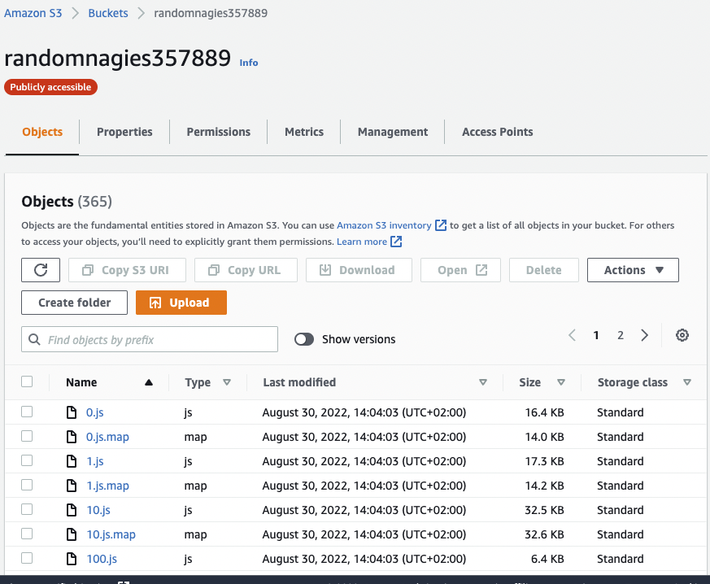

# Hosting a Full-Stack Application
---
## Udagram-api

## Getting Started

1. Clone this repo locally into the location of your choice.
1. Move the content of the udagram-api folder at the root of the repository as this will become the main content of the project.
1. Open a terminal and navigate to the root of the repo
1. follow the instructions in the installation step

### Dependencies

```
- Node v14.15.1 (LTS) or more recent. While older versions can work it is advisable to keep node to latest LTS version

- npm 6.14.8 (LTS) or more recent, Yarn can work but was not tested for this project

- AWS CLI v2, v1 can work but was not tested for this project

- A RDS database running Postgres.

- A S3 bucket for hosting uploaded pictures.

```
# Udagram

This project is part of the Udacity FullStack JavaScript nanodegree. The code was given as a starter project and the task was to employ and adapt the code to get it working and hosted on AWS.

The project is available at

http://randomnagies357889.s3-website-us-east-1.amazonaws.com

### Installation

Run `npm install` in both (udagram-api & udagram-fronend) to download the necessary dependencies.

## Running Udagram locally

You will need to create a `.env` file in `udagram-api` with the following variables set:
- AWS_ACCESS_KEY_ID
- AWS_DEFAULT_REGION
- AWS_SECRET_ACCESS_KEY
- JWT_SECRET
- POSTGRES_DB
- POSTGRES_HOST
- POSTGRES_PASSWORD
- POSTGRES_PORT
- POSTGRES_USERNAME
- PORT 
- URL

Open 2 terminal windows:
1. Navigate to `udagram-api` and run `npm run dev`
2. Navigate to `udagram-frontend` and run `npm run start`

Open `http://localhost:8080` in the browser.


Provision the necessary AWS services needed for running the application:

1. In AWS, provision a publicly available RDS database running Postgres. <Place holder for link to classroom article>
1. In AWS, provision a s3 bucket for hosting the uploaded files. <Place holder for tlink to classroom article>
1. Export the ENV variables needed or use a package like [dotnev](https://www.npmjs.com/package/dotenv)/.
1. From the root of the repo, navigate udagram-api folder `cd starter/udagram-api` to install the node_modules `npm install`. After installation is done start the api in dev mode with `npm run dev`.
1. Without closing the terminal in step 1, navigate to the udagram-frontend `cd starter/udagram-frontend` to intall the node_modules `npm install`. After installation is done start the api in dev mode with `npm run start`.


## Configuration Screenshots

### Elastic Beanstalk Environment


### FrontEnd S3 Bucket



### Backend S3 Bucket


### PostgreSQL RDS database


### CircleCI Pipeline


### CircleCI ENV


### eb ENV


### Architecture


This project contains two different test suite: unit tests and End-To-End tests(e2e). Follow these steps to run the tests.

1. `cd starter/udagram-frontend`
1. `npm run test`
1. `npm run e2e`

There are no Unit test on the back-end

### Unit Tests:

Unit tests are using the Jasmine Framework.

### End to End Tests:

The e2e tests are using Protractor and Jasmine.

## Built With

- [Angular](https://angular.io/) - Single Page Application Framework
- [Node](https://nodejs.org) - Javascript Runtime
- [Express](https://expressjs.com/) - Javascript API Framework

## License

[License](LICENSE.txt)
